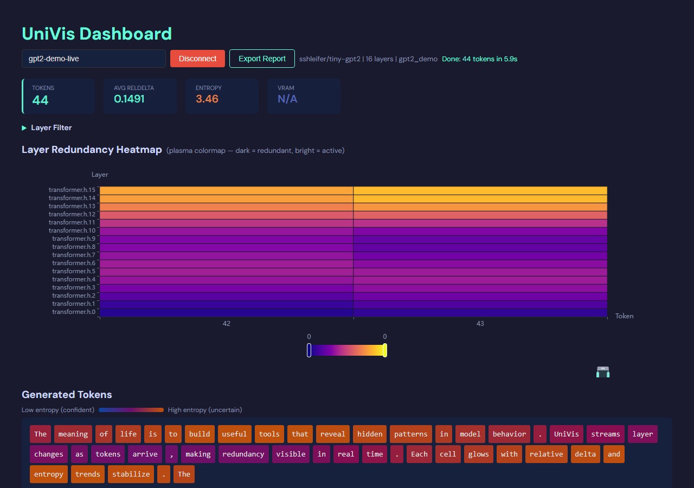

<div align="center">

# UniVis

**Open-source observability for Transformer inference — see which layers compute, and which are redundant.**

[](https://www.python.org/downloads/)
[](https://pytorch.org/)
[](LICENSE)
[](tests)
[](CONTRIBUTING.md)

English · [简体中文](README.md)

</div>



UniVis is a lightweight diagnostic toolkit that attaches to any PyTorch / HuggingFace Transformer and visualizes per-layer behavior during inference. By computing compact metrics on the fly through `forward` hooks, it produces dynamic heatmaps and standalone reports that make *"where is compute actually happening — and where is it being wasted"* immediately legible.

It is a **measurement & visualization** tool. It does not modify, prune, or accelerate your model — it gives you the evidence to decide what to optimize, plus an experimental path to act on it.

---

## ✨ Showcase

<table>
<tr>
<td width="50%" align="center"><b>Real-time Dashboard</b></td>
<td width="50%" align="center"><b>Model MRI · concentric rings</b></td>
</tr>
<tr>
<td width="50%" align="center"></td>
<td width="50%" align="center"></td>
</tr>
<tr>
<td width="50%" align="center"><sub>Heatmap grows left-to-right as tokens are generated (plasma: dark = redundant, bright = active)</sub></td>
<td width="50%" align="center"><sub>Each layer as a ring — orange = active, gray-green = redundant. Spot the idle layers at a glance.</sub></td>
</tr>
<tr>
<td width="50%" align="center"><b>Layer pulse + data river</b></td>
<td width="50%" align="center"><b>Multi-model comparison</b></td>
</tr>
<tr>
<td width="50%" align="center"></td>
<td width="50%" align="center"></td>
</tr>
<tr>
<td width="50%" align="center"><sub>A sparkline per layer: flat = redundant, spiking = active; ThemeRiver shows activity over tokens</sub></td>
<td width="50%" align="center"><sub><code>univis compare</code> cross-model redundancy distribution</sub></td>
</tr>
</table>

<div align="center">

**Cross-scale finding: middle-layer redundancy is most pronounced — and holds from 0.5B → 27B**


<sub>Qwen2.5-0.5B / 3B / 7B + Qwen3.6-27B (~54× parameter span, Dense & hybrid). With layer depth normalized to [0,1], the middle segment shows markedly higher cosine similarity than shallow/deep layers in all four models.</sub>

</div>

---

## Why

Transformer inference is expensive, and not every layer or generation step contributes equally. Existing tools tend to look elsewhere:

- **TensorBoard / W&B** track training-time scalars (loss, learning rate) and treat the network as a black box at inference.
- **BertViz** explains attention semantics, not runtime compute cost.
- **NVIDIA Nsight / profilers** operate at the GPU-operator level — powerful, but hard to map back to *"which Transformer layer."*

UniVis fills the missing semantic layer: **per-layer, per-token redundancy during inference**, at just a few KB per step.

## Features

- **Zero-intrusion hooks** — no changes to the target model; attach and run.
- **Edge-computed metrics** — tensors reduced to scalars inside the hook; each step's payload is ~1–2 KB with negligible inference overhead.
- **5 core metrics** — relative delta, cosine similarity, activation sparsity, prediction entropy, VRAM delta.
- **Architecture auto-detection** — GPT-2, LLaMA / Mistral / Mixtral, Qwen (1.5 / 2 / 2.5 / 3), BERT family.
- **Three output modes** — JSONL log, standalone offline HTML report, real-time WebSocket dashboard.
- **`model.generate()` integration** — plugs in via a HuggingFace `LogitsProcessor`, no manual loop changes.
- **Rich reports** — model-MRI rings, layer-pulse sparklines, ThemeRiver data-river, plasma heatmap, redundancy ranking with trend annotations.
- **Multi-model comparison** — `univis compare` CLI with radar charts and tables.
- **Pilot intervention (experimental)** — threshold-based early-exit during generation, with quantitative perplexity impact.

## How it works

```
your model
    │  univis.attach(model)
    ▼
┌──────────────────────── univis SDK ───────────────────────┐
│  detection → probe (forward_hook) → metrics → transport    │
│   (auto-detect)  (per-layer)      (scalar)   (JSONL/HTTP)  │
│                                                            │
│   metrics computed at the edge ── only KB of JSON emitted  │
└───────────────────────────┬────────────────────────────────┘
                            │ HTTP POST → WebSocket
                            ▼
                  React + ECharts dashboard
                  (live heatmap · stats · filters)
                            │
                            ▼  tracker.finish()
                  standalone HTML report
```

The design principle is **edge computing**: high-dimensional activations are reduced to scalar metrics right inside the hook, so monitoring never blocks inference.

## Quick start

```bash
pip install -e ".[dev]"
```

### Pattern A — Minimal (SDK only, offline report)

```python
import univis

tracker = univis.attach(model, transport="file")
for token_id in generate_loop():
    tracker.on_step(token_id)
report_path = tracker.finish()   # → standalone HTML report
```

### Pattern B — `model.generate()` integration

```python
tracker = univis.attach(model)
lp = tracker.logits_processor(tokenizer)
output = model.generate(input_ids, logits_processor=[lp], max_new_tokens=50)
tracker.finish()
```

### Pattern C — Real-time dashboard

```bash
python -m univis serve              # terminal 1: WebSocket server
cd dashboard && npm run dev         # terminal 2: dashboard (:5173)
python your_script.py               # terminal 3: inference with transport="websocket"
```

## CLI

```bash
python -m univis serve --port 8765               # start the WebSocket server
python -m univis report data.jsonl -o out.html    # render an HTML report from JSONL
python -m univis compare a.jsonl b.jsonl -o c.html  # cross-model comparison
```

## Metrics

| Metric | Formula | Meaning |
|---|---|---|
| Relative Delta | `‖output − input‖₂ / ‖input‖₂` | How much the representation changed at this layer (primary heatmap metric) |
| Cosine Similarity | `cos(input, output)` | Directional alignment between input and output |
| Activation Sparsity | `count(|x| < ε) / total` | Fraction of near-zero activations |
| Prediction Entropy | `H(softmax(logits))` | Model uncertainty at this step |
| VRAM Delta | `Δ torch.cuda.memory_allocated()` | Memory pressure introduced by this step |

Relative Delta is the primary heatmap metric. Because Transformers use residual connections, cosine similarity saturates above 0.9 and blurs inter-layer differences; Relative Delta directly measures *"how much this layer changed"* and is far more sensitive to redundancy in residual architectures.

## Supported models

| Architecture | Variants |
|---|---|
| GPT-2 | gpt2, gpt2-medium, gpt2-large, gpt2-xl |
| LLaMA | LLaMA 1/2/3, Mistral, Mixtral |
| Qwen | Qwen 1.5, Qwen 2, Qwen 2.5, Qwen 3 |
| BERT | BERT, RoBERTa, ALBERT, DeBERTa |

Architectures are auto-detected from the model config — no manual registration. Verified on Qwen2.5-0.5B / 3B / 7B and Qwen3-27B-class hybrid models (~54× parameter span).

## Roadmap

- **Pilot early-exit** — turn measurement into action: exit generation when the model is confident enough, with explicit *quality (perplexity) ↔ speedup* tradeoff curves. (Naive layer-skipping was found to harm quality, so the focus is confidence-based early-exit.)
- **Domestic-accelerator adaptation** — validate hooks and metrics on domestic AI compute (e.g. the MXMACA software stack), so redundancy diagnostics work across NVIDIA and domestic GPUs.
- **DiT / video generation** — monitor temporal redundancy across denoising steps and enable time-step-level early stop.
- **Sub-layer granularity** — drill from Transformer block down to Attention and FFN.
- **Redundancy–quality study** — empirical correlation between UniVis metrics and downstream quality loss after pruning / layer-skip.

## Architecture & testing

Full module design, data model, and API in [ARCHITECTURE.md](ARCHITECTURE.md); scope and motivation in [PRD.md](PRD.md). The SDK is covered by **80 unit tests** across 9 files.

```
src/univis/      Python SDK — attach() → on_step() → finish()
dashboard/       React 18 + TypeScript + ECharts frontend
docs/images/     sample reports and charts
examples/        runnable examples
tests/           80 unit tests
```

## Contributing

Contributions are welcome — new metric plugins, model adapters, dashboard views, and benchmarks are all useful. See [CONTRIBUTING.md](CONTRIBUTING.md). The metric functions in `metrics.py` are pure and independently testable, which makes adding a new metric low-risk.

## License

[MIT](LICENSE).

## Acknowledgements

Computing resources and technical discussions from the AI Systems research group at Sun Yat-sen University. Built on PyTorch, FastAPI, React, and ECharts.
