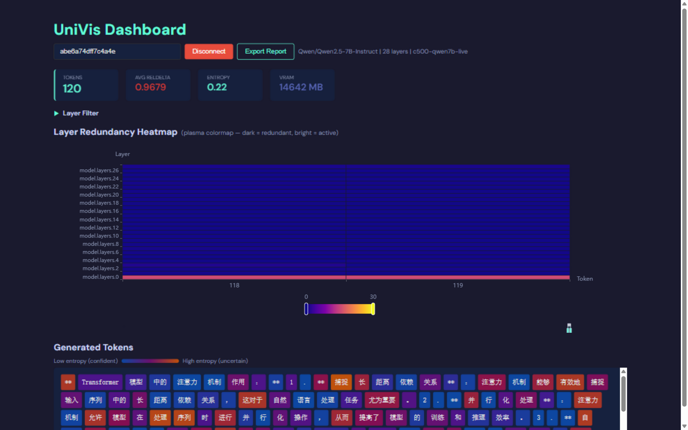
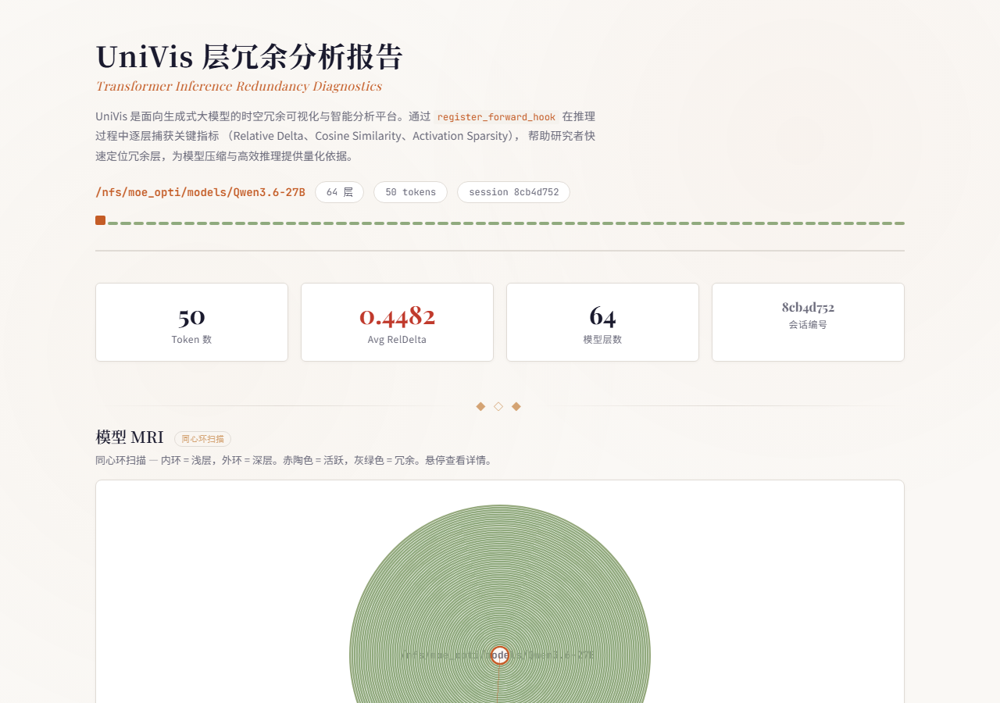
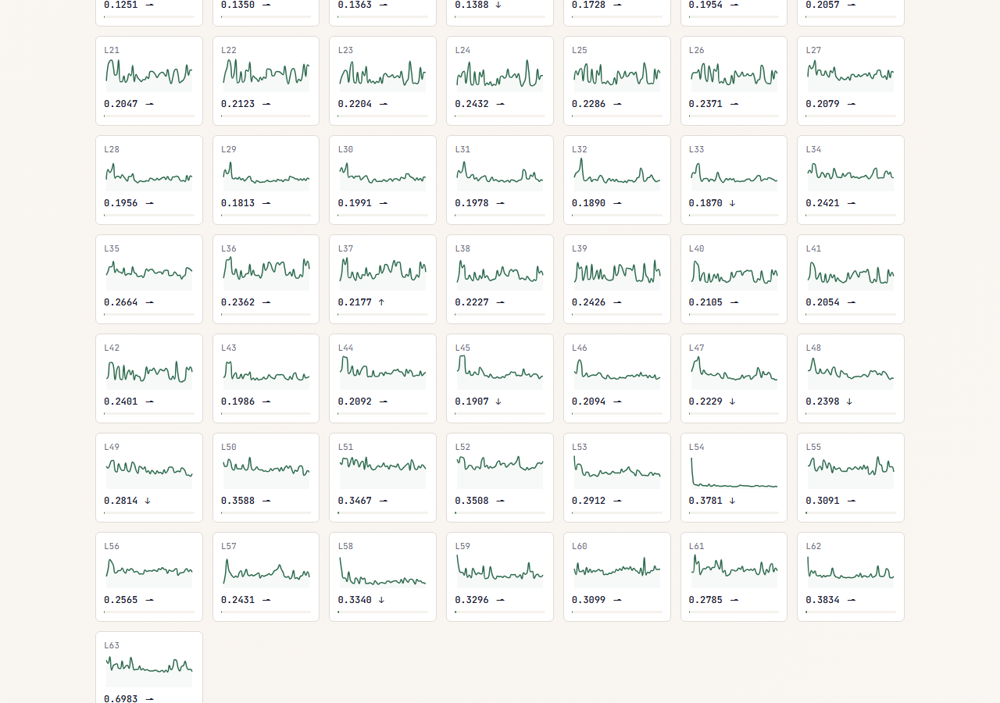
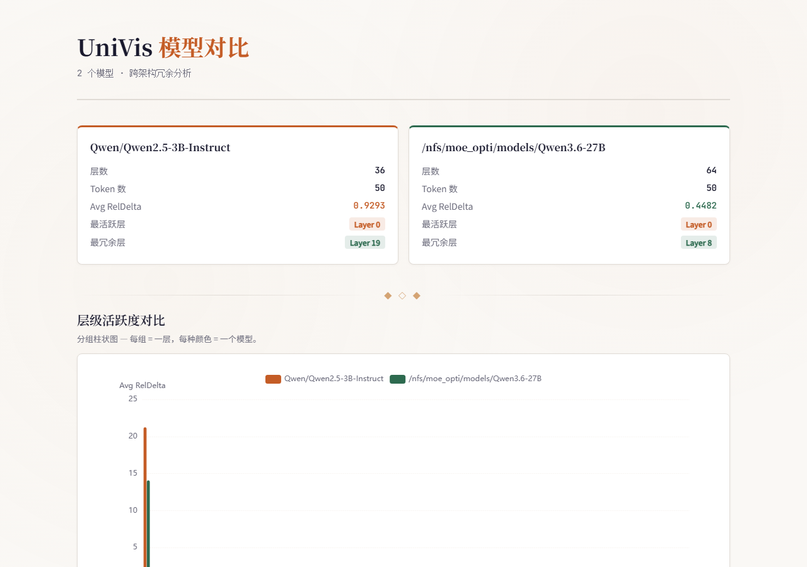
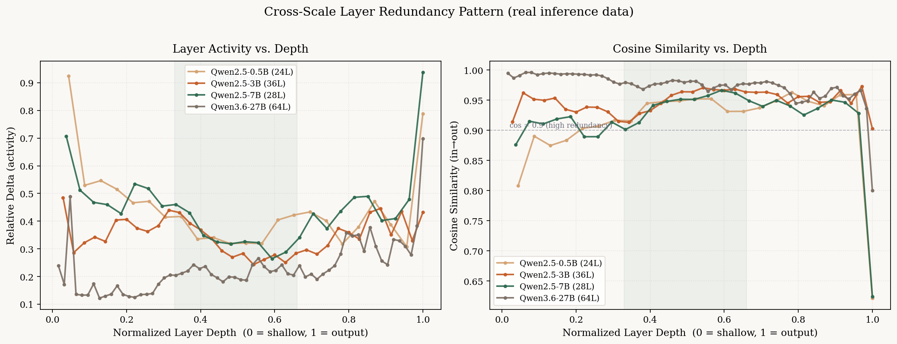

<div align="center">

# UniVis

**找出大模型推理时哪些层在空转浪费算力 —— Transformer 推理冗余诊断与可视化工具**

*Find out which layers of your LLM actually compute at inference — and which are idle.*

`AI Infra · 大模型推理优化与部署`

[](https://github.com/cookiesheep/univis/actions/workflows/ci.yml)
[](tests)
[](https://www.python.org/downloads/)
[](https://pytorch.org/)
[](LICENSE)
[](CONTRIBUTING.md)

[English](README.en.md) · 简体中文

</div>



UniVis 通过 `forward` hook 零侵入地附着在任意 PyTorch / HuggingFace Transformer 上，在**端侧（hook 内部）**把每层激活降维为标量指标（单步仅约 1–2 KB），经 JSONL / WebSocket 输出实时 Dashboard 或自包含离线 HTML 报告，回答一个问题：**推理时，哪些层在真正计算，哪些层在冗余。**

UniVis 是**度量与可视化**工具——不修改、不剪枝、不加速你的模型，而是给出判断「该优化什么」的证据，并提供一条可实验的干预路径（Pilot）。

---

## ✨ 效果展示

<table>
<tr>
<td width="50%" align="center"><b>实时 Dashboard</b></td>
<td width="50%" align="center"><b>模型 MRI · 同心环</b></td>
</tr>
<tr>
<td width="50%" align="center"></td>
<td width="50%" align="center"></td>
</tr>
<tr>
<td width="50%" align="center"><sub>Qwen2.5-7B 实时推理于沐曦曦云 C500：热力图随 token 生成从左到右动态生长（plasma：暗=冗余，亮=活跃）</sub></td>
<td width="50%" align="center"><sub>每一层画成同心环，橙色=活跃、灰绿色=冗余，一眼定位「摸鱼层」</sub></td>
</tr>
<tr>
<td width="50%" align="center"><b>层级脉冲 + 数据河流</b></td>
<td width="50%" align="center"><b>多模型对比报告</b></td>
</tr>
<tr>
<td width="50%" align="center"></td>
<td width="50%" align="center"></td>
</tr>
<tr>
<td width="50%" align="center"><sub>每层一个迷你波形：平线=冗余、尖峰=活跃；ThemeRiver 展示活跃度随 token 流动</sub></td>
<td width="50%" align="center"><sub><code>univis compare</code> 横向比较多个模型的冗余分布</sub></td>
</tr>
</table>

## 为什么需要 UniVis

Transformer 推理成本与显存随参数量暴涨，但并非每一层、每个生成步骤贡献相同——省算力就是省钱，这在国产算力资源紧张的当下尤其重要。要优化，先要知道冗余在哪里。现有工具却都看向别处：

| 工具 | 观测期 | 粒度 | 侵入性 | 上手门槛 |
|---|---|---|---|---|
| TensorBoard / W&B | 训练期 | loss 等宏观标量 | 需埋点 | 低 |
| BertViz | 推理期 | 注意力语义 | 需写分析脚本 | 中 |
| Nsight 等 profiler | 推理期 | GPU 算子 / 内核 | 环境级插桩 | 高 |
| **UniVis** | **推理期** | **逐层 × 逐 token 冗余指标** | **零侵入 hook** | **低** |

UniVis 填补的是中间缺失的语义层：**推理期逐层、逐 token 的冗余度量**，每步只传输几 KB。

## 国产算力与 MXMACA 适配

UniVis 的实现天然面向跨硬件移植，以下事实逐条可查证：

- **纯 PyTorch `forward` hook 实现**，无任何 CUDA 专有 API 依赖；
- 指标在**端侧**（hook 内部）计算，单步负载仅 1–2 KB，不增加推理瓶颈；
- 离线路径（JSONL → HTML 报告）**纯 CPU 可运行**；
- 不依赖特定 GPU 厂商的 profiler 工具链。

### 环境矩阵

| 环境 | 硬件 | 状态 | 已验证内容 |
|---|---|---|---|
| NVIDIA L20（48GB） | NVIDIA GPU | ✅ **已验证** | Qwen2.5-0.5B / 3B / 7B + 27B 级 hybrid 完整诊断（跨约 54× 参数跨度） |
| CPU（无 GPU） | — | ✅ **已验证** | 全量 82 项单元测试、离线报告渲染 |
| MetaX 曦云 C500（sGPU 切分实例） | 沐曦 GPU + MXMACA 软件栈 | ✅ **阶段 A + B 已验证** | Qwen2.5-0.5B / 3B / 7B 跨硬件对照（与 NVIDIA L20 画像一致性 r ≥ 0.9998），[证据存档](docs/mxmaca/phase-b/README.md) |

### 阶段化路线图

| 阶段 | 目标 | 完成判据 | 状态 |
|---|---|---|---|
| A | 曦云 C500 指标采集通路验证 | Qwen2.5-0.5B 完整生成一次，产出 HTML 报告 + JSONL 留档 + 环境指纹（MXMACA / mcPyTorch 精确版本 + `mx-smi` 输出） | ✅ **已完成（2026-08-19）**，[证据](docs/mxmaca/phase-a/README.md) |
| B | C500 跨规模冗余基线 | 0.5B / 3B / 7B 基线报告 + 与 NVIDIA L20 同模型同提示词的对比表 | ✅ **已完成（2026-08-19）**：三规模画像一致性 r ≥ 0.9998，[证据](docs/mxmaca/phase-b/README.md)（27B 需整机 C500，属后续） |
| C | 诊断结果反哺沐曦生态 | 以冗余定位结论作为 FlagGems / mcTriton 算子优化的输入示例 | 规划中 |

### 精确支持契约与范围声明

| 项 | 当前契约 |
|---|---|
| 已实测模型 | Qwen2.5-0.5B / 3B / 7B-Instruct（bf16）、Qwen3.6-27B（hybrid） |
| 自动识别架构 | GPT-2 系；LLaMA 系（LLaMA 1/2/3、Mistral、Mixtral）；Qwen 系（1.5 / 2 / 2.5 / 3）；BERT 系（BERT、RoBERTa、ALBERT、DeBERTa） |
| 软件栈 | NVIDIA 栈：Python ≥ 3.10、PyTorch ≥ 2.0、HF transformers（L20 实测）；沐曦栈：torch 2.8.0+metax3.3.0.2、MACA 3.3.0.15、transformers 4.57.3（C500 阶段 A 实测） |
| 硬件 | NVIDIA GPU（CUDA）与 CPU 已验证；沐曦 MXMACA 适配按阶段推进（见上） |

**范围声明：**以上验证仅限所列模型与架构，冗余结论不外推到未测模型——这恰恰是 UniVis 的价值：在新模型上跑一次诊断，得到它自己的冗余画像，再谈优化。

### 无卡可审计

UniVis 的全部诊断产出——JSONL 原始数据、自包含 HTML 报告、环境指纹——都可在**无 GPU 环境**直接打开复核。诊断工具本身就是证据链：C500 阶段 A 的完整证据（数据、报告、指纹）已发布于 [docs/mxmaca/phase-a/](docs/mxmaca/phase-a/README.md)，任何人无需租卡即可审计。

我们期待与沐曦及 MXMACA 社区在测试资源、技术指导与生态联动上展开合作。适配详情与环境指纹规范见 [docs/mxmaca-adaptation.md](docs/mxmaca-adaptation.md)。

## 核心功能

- **低侵入 SDK** —— `univis.attach(model)` 一行挂载；detection 按模型 config 自动识别架构，probe 以 `forward` hook 逐层采集，无需改动目标模型。5 项核心指标：Relative Delta、层间余弦相似度、激活稀疏度、预测熵、显存变化。
- **实时 Dashboard** —— React 18 + TypeScript + ECharts，热力图随 token 生成从左到右生长，支持统计面板、过滤与点击交互。
- **离线 HTML 报告** —— 单文件、零依赖、可直接打开：模型 MRI 同心环、层级脉冲、ThemeRiver 数据河流、带趋势标注的冗余排名。
- **多模型对比 CLI** —— `univis compare` 横向比较多个模型的冗余分布，含雷达图与对比表。
- **Pilot 干预（实验性）** —— 把度量变成行动：基于预测熵的生成提前终止（early-exit）；layer-skip 路线的负结果已完整公开（见下节）。
- **工程质量** —— 82 项单元测试全绿、GitHub Actions CI、3 个 CLI 入口、Python 3.10+ 全类型注解。

## 实验发现

### 1. 中间层冗余最显著，且跨规模稳定成立

<div align="center">



<sub>Qwen2.5-0.5B / 3B / 7B + Qwen3.6-27B（hybrid），参数跨度约 54 倍。层深度归一化到 [0,1] 后，四个模型的中间段余弦相似度都明显高于浅层与深层。</sub>

</div>

### 2. 一次公开的失败：layer-skip 不成立

Pilot v1 曾按「高余弦相似度 = 可跳过」的直觉跳过中间冗余层，实测（Qwen2.5-7B，NVIDIA L20）：

| 配置 | perplexity | 变化 |
|---|---|---|
| 基线（全部层） | 13.81 | — |
| 跳过中间冗余层 | 105.67 | **+665%** |

结论：残差架构里余弦相似度饱和 ≠ 该层无用，「看似冗余」的层仍承担必要的细化计算（完整记录见 commit `1938d60` 与 `examples/pilot_perplexity.py`）。据此 Pilot 转向**基于置信度的 early-exit**：当预测熵持续低于阈值时提前结束生成。

**early-exit 首批权衡数据（C500 实测，Qwen2.5-0.5B/3B）**：朴素逐 token 熵阈值不可用——聊天模型的格式化 token 形成散布全答案的超低熵簇，任何阈值都会过早截断；引入**连续窗口判据**（`entropy_window`，连续 N 步低熵才退出）后得到单调可控的权衡曲线：保守档省 ~9% token 保留 93% 内容，激进档省 66% 保留 42%（8 提示词 × 128 token，greedy）。曲线族与原始数据见 [docs/mxmaca/phase-b/](docs/mxmaca/phase-b/README.md#附带发现-2窗口化-early-exit-首批权衡数据)。

### 3. 跨硬件实证：冗余画像在沐曦 C500 与 NVIDIA L20 上一致

同一模型、同一提示词、同一解码协议（greedy / bf16 / 50 token），分别在 MetaX 曦云 C500 与 NVIDIA L20 上诊断，逐层冗余画像的皮尔逊相关系数：

| 模型 | r（余弦画像） | r（Relative Delta 画像） |
|---|---|---|
| Qwen2.5-0.5B | 0.9998 | 1.0000 |
| Qwen2.5-3B | 1.0000 | 1.0000 |
| Qwen2.5-7B | 1.0000 | 1.0000 |

在该测试范围内，「哪些层冗余」的结论跨硬件可迁移——无需为每种 GPU 重新推导。方法学与全部数据见 [docs/mxmaca/phase-b/](docs/mxmaca/phase-b/README.md)。同轮 C500 实测还驱动了一次工具自身的重要修复：hook 采集开销从旧实现的多层数下 +400~486%（逐层设备同步被放大）优化到 +55% 量级（每步一次批量回传），指标数值逐位不变——「先测量，再优化」正是 UniVis 的用途示范。

*以上实验环境：NVIDIA L20（48GB）与 MetaX 曦云 C500（16GB sGPU 切分）；27B 级模型为 L20 单侧验证。*

## 快速开始

```bash
git clone https://github.com/cookiesheep/univis && cd univis
pip install -e ".[dev]"
```

**A · 离线报告（最简）**

```python
import univis

tracker = univis.attach(model, transport="file")
for token_id in generate_loop():
    tracker.on_step(token_id)
report_path = tracker.finish()   # → 自包含 HTML 报告
```

**B · `model.generate()` 集成**

```python
tracker = univis.attach(model)
lp = tracker.logits_processor(tokenizer)
output = model.generate(input_ids, logits_processor=[lp], max_new_tokens=50)
tracker.finish()
```

**C · 实时 Dashboard**

```bash
python -m univis serve              # 终端 1：WebSocket 服务（:8765）
cd dashboard && npm run dev         # 终端 2：Dashboard（:5173）
python your_script.py               # 终端 3：transport="websocket" 运行推理
```

三个 CLI 入口：`univis serve`（实时服务）、`univis report`（JSONL → HTML）、`univis compare`（多模型对比）。

## 架构

```
你的模型
    │  univis.attach(model)
    ▼
┌──────────────────────── univis SDK ───────────────────────┐
│  detection → probe (forward_hook) → metrics → transport    │
│           (自动识别)   (逐层)        (标量)    (JSONL/HTTP)  │
│                                                            │
│   指标在端侧算好 ── 只输出 KB 级 JSON                       │
└───────────────────────────┬────────────────────────────────┘
                            │ HTTP POST → WebSocket
                            ▼
                  React + ECharts Dashboard
                  （实时热力图 · 统计 · 过滤）
                            │
                            ▼  tracker.finish()
                  可独立打开的 HTML 报告
```

三层组成：采集 SDK（detection / probe / metrics / transport / tracker / pilot）、FastAPI WebSocket 服务、React 前端。核心设计是**边缘计算**：高维激活在 hook 内部就地降维为标量，监控永不阻塞推理。完整模块设计与 API 见 [ARCHITECTURE.md](ARCHITECTURE.md)，范围与动机见 [PRD.md](PRD.md)。

## 工程质量

- **82 项单元测试**（8 个测试文件）覆盖 SDK、server、报告生成、三终端链路与 Pilot，`pytest tests/` 全绿；
- **GitHub Actions CI**：每次 push 在 Python 3.10 / 3.12 + CPU torch 上自动跑全量测试；
- Python ≥ 3.10 全类型注解，SDK 10 个模块，公开 API 统一在 `__init__.py` 导出。

```
src/univis/      Python SDK —— attach() → on_step() → finish()
dashboard/       React 18 + TypeScript + ECharts 前端
docs/images/     报告与图表样例
examples/        可运行示例
tests/           82 项单元测试
```

## 路线图

- **近期** —— Pilot early-exit：首批权衡数据已产出（C500，窗口判据），扩展到更多提示词集与 27B 级；C500 剩余 ~55% 采集开销的继续压缩；27B 级 C500 整机验证。
- **中期** —— MXMACA 验证深化（阶段 C，对接 FlagGems / mcTriton 生态）；DiT / 视频生成模型（去噪步之间的时序冗余）；hook 下钻到 Attention / FFN 子层。
- **远期** —— 70B+ 与 MoE 模型；接入主流推理框架。

## 社区与合作

UniVis 已用于实验室内部日常诊断与教学演示。GitLink 镜像筹备中。欢迎贡献——新的指标插件、模型适配、Dashboard 视图与 benchmark 都有价值，参见 [CONTRIBUTING.md](CONTRIBUTING.md)；`metrics.py` 中的指标函数是纯函数、可独立测试，新增指标风险很低。

## 许可证

[MIT](LICENSE)

## 鸣谢

感谢中山大学 AI Systems 研究组提供的算力资源与技术讨论。本项目基于 PyTorch、FastAPI、React、ECharts 构建。
