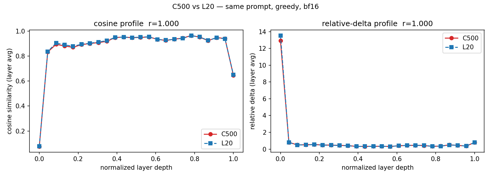
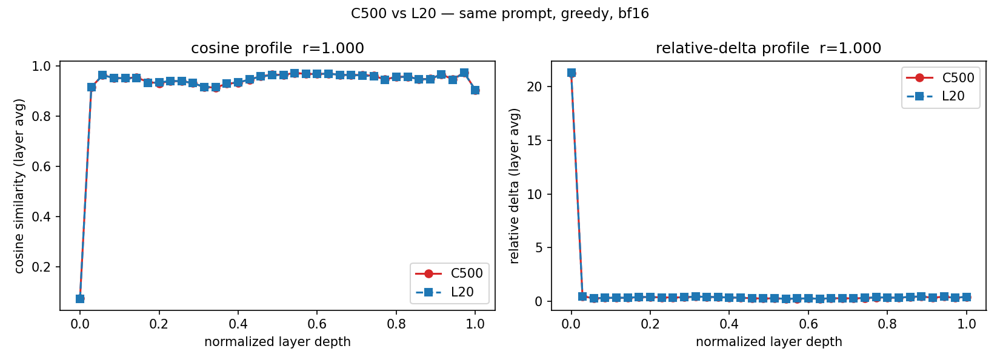
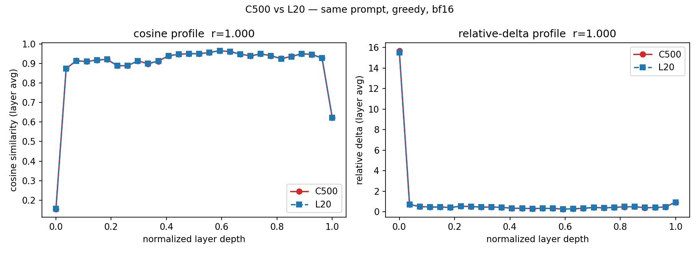
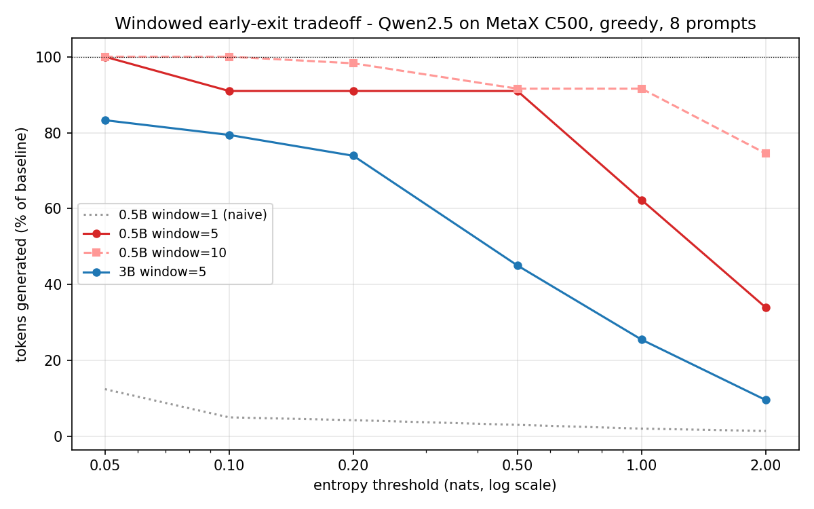

# Phase B 验证记录 — C500 跨规模基线 × NVIDIA L20 对照

**状态：已完成（2026-08-19，0.5B / 3B / 7B 三个规模）**。同一模型、同一提示词、同一解码协议（greedy、bf16、50 新 token、无 chat template），分别在 MetaX 曦云 C500（16GB sGPU 切分实例）与 NVIDIA L20（48GB）上运行 UniVis 诊断，逐层冗余画像直接对比。

## 核心结论：冗余画像跨硬件一致

| 模型 | 层数 | Pearson r（余弦画像） | Pearson r（Relative Delta 画像） | MAE 余弦 | MAE RD |
|---|---|---|---|---|---|
| Qwen2.5-0.5B-Instruct | 24 | 0.9998 | 1.0000 | 0.0031 | 0.0338 |
| Qwen2.5-3B-Instruct | 36 | 1.0000 | 1.0000 | 0.0011 | 0.0057 |
| Qwen2.5-7B-Instruct | 28 | 1.0000 | 1.0000 | 0.0005 | 0.0075 |

三个规模的层级冗余画像在沐曦 C500 与 NVIDIA L20 之间**皮尔逊相关系数全部 ≥ 0.9998**。这意味着：在该测试范围内，「哪些层冗余」的结论跨 NVIDIA / 沐曦硬件可迁移——在一种硬件上得到的冗余诊断，无需在另一种硬件上重新推导。

## 方法学

### 协议（与 L20 原始跨规模实验完全一致）

- 提示词：`请简述 Transformer 模型中注意力机制的作用，并讨论为什么深层网络可能出现计算冗余。`（raw 输入，无 chat template）
- 解码：greedy（do_sample=False），max_new_tokens=50，bf16
- 指标：UniVis 默认三件套（relative_delta / cosine_sim / sparsity），逐层逐 token，层平均后做画像对比
- 复现脚本：`scripts/phase_b_run.py`（采集）+ `scripts/compare_hardware.py`（分析）

### 环境

| 侧 | 硬件 | 软件栈 |
|---|---|---|
| C500 | MetaX 曦云 C500 sGPU 切分（16GB 显存配额 / 64GB 物理，25% 算力） | torch 2.8.0+metax3.3.0.2、MACA 3.3.0.15、transformers 4.57.3、Python 3.10 |
| L20 | NVIDIA L20 48GB ×1（驱动 575.51.03） | torch 2.10.0+cu128、transformers 4.57.6、Python 3.10 |

**意外发现（边界实测）**：Qwen2.5-7B（bf16 权重约 15.3GB）在 16GB 切分实例上可以完整加载并完成诊断——原本预期 OOM，实测通过，因此 7B 对照也包含在本次结果中。27B 级模型（Qwen3.6-27B，64 层）仍需整机 C500，属后续范围。

### 重跑稳定性（方法学保障）

同一硬件（L20）、同一协议、间隔两个月的两次运行，画像相关性：0.5B r=0.9985、3B r=1.0000、7B r=1.0000。说明跨硬件对比中的差异（≤0.0005 的 MAE 量级）来自数值栈而非运行噪声。

### 多提示词与跨架构扩展（10 提示词集）

单提示词结论在 10 条多样化提示词（中英混合，含翻译/代码/数学/常识）下复测，并新增 **TinyLlama-1.1B（Llama 架构，非 Qwen 系）** 检验架构可移植性：

| 模型 | 架构 | r（余弦） | r（RD） | MAE 余弦 / RD |
|---|---|---|---|---|
| Qwen2.5-0.5B | Qwen2 | 1.0000 | 1.0000 | 0.0008 / 0.0055 |
| Qwen2.5-3B | Qwen2 | 1.0000 | 1.0000 | 0.0007 / 0.0032 |
| Qwen2.5-7B | Qwen2 | 1.0000 | 1.0000 | 0.0005 / 0.0013 |
| TinyLlama-1.1B | Llama | 0.9968 | 0.9998 | 0.0040 / 0.0108 |

多提示词聚合下 Qwen 三规模的相关性反而更紧（每文件约 500 步聚合）。一个诚实的细节：3B 在两侧的贪心解码有约 14/500 步的分叉（跨硬件数值微差在个别 token 上改变贪心选择），0.5B/7B/TinyLlama 完全同步；该分叉不影响层级画像对比（按层平均）。数据在 `data-multi/`（每模型 C500/L20 各一份）。

**数据勘误（2026-08-20）**：`data-multi/` 中各文件的 `sparsity` 列因采集端一处签名缺陷（commit `c11d423` 重构引入，`hidden_out` 被误作阈值传入稀疏度函数；已于 2026-08-20 修复并加回归测试）而无效——该缺陷仅在多设备配置下显式报错，单设备下静默产出错误值。`relative_delta` 与 `cosine_sim` 两列不受影响（签名本就匹配），**本页全部 r 值与结论仅基于这两项，仍然成立**。L20 侧已用修复版重采（data-multi 中 l20_* 文件已替换）；C500 侧待 27B 整机会话一并重采后更新。画廊中受影响的 4 份多提示词报告已暂时下架。

## 数据文件

`data/` 下 6 份 JSONL（C500 与 L20 各三规模，每份 50 步 × 对应层数）；图表 PNG 由 `scripts/compare_hardware.py --chart` 生成。环境指纹见 [phase-a/env-fingerprint.txt](../phase-a/env-fingerprint.txt)（C500 侧同实例）。

## 附带发现 1：hook 采集开销在 MACA 栈上的诊断与修复

C500 实测把「监控开销可忽略」的假设打回了原形，也顺手完成了修复（Qwen2.5 × 50 token 生成，best-of-5 计时）：

| 模型 | 旧路径（每层 2 次 `.cpu()` 全张量拷贝，C500） | 修复后 C500 | 修复后 L20（同代码） |
|---|---|---|---|
| Qwen2.5-0.5B | +62.5% | +59.3% | +65.5% |
| Qwen2.5-3B | **+400.1%** | **+54.7%** | +64.2% |
| Qwen2.5-7B | **+486.1%** | +56.9% | **+17.1%** |

根因（C500 侧）：旧实现每层每 token 触发 2 次阻塞式设备同步（36 层 = 72 次/token），逐层同步开销在多层数下急速放大。修复（commit `c11d423`、`5a2eef2`）：指标在设备端算成张量、每步一次批量回传，大模型开销从 ~5 倍降到 ~1.5 倍量级，指标数值与旧实现逐位一致（r=1.0000，MAE=0.0000）。修复后的剩余开销（两栈小模型均 ~+55-65%，7B on L20 +17%）主要来自逐层 Python 与小算子调度，随模型变大（单 token 计算变重）占比下降——进一步压缩（子层采样、低频采集等）是明确的后续方向。这次诊断本身就是 UniVis 用途的示范：**先测量，再优化**。

## 附带发现 2：窗口化 early-exit 首批权衡数据

在 C500 上对 Qwen2.5-0.5B/3B 扫「熵阈值 × 连续窗口」（8 提示词 × 128 token，greedy）：

- **朴素逐 token 阈值（窗口=1）不可用**：聊天模型的格式化 token（编号、标点）形成 1-3 步的超低熵簇（熵可低至 0.005 nats），散布在答案全程，任何阈值都会在开头附近触发截断（kept 仅 0.03-0.22）；
- **窗口=5/10 修复了判据**：要求连续 5/10 步低熵再退出，得到单调可控的权衡曲线。24 条多样化提示词（中英混合，含翻译/代码/数学/常识）扩展集（`ee_ext_*_w5.json`）：
  - 0.5B（窗口 5）：阈值 0.05 → 省 2% token 保留 96%；0.2 → 省 22% 保留 79%；2.0 → 省 78% 保留 30%（触发 20/24）；
  - 3B（窗口 5）：阈值 0.05 → 省 22% 保留 79%；0.5 → 省 53% 保留 53%；2.0 → 省 92% 保留 17%。
  曲线族见下图，原始数据在 `early-exit/*.json`（8 提示词初扫 + 24 提示词扩展集）。

## 范围声明

以上结论仅覆盖所列模型、软件栈版本与单一提示词协议；冗余结论不外推到未测模型。27B 级与更长生成、更多提示词集的扩展随阶段 B 后续进行。
